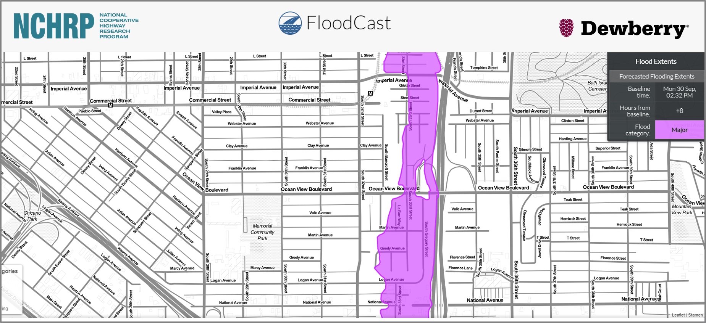

---

# Documents 

---

Welcome to the __*floodcast*__ documentation page! [View the project on GitHub.](https://github.com/Dewberry/fcast)

This project is early in its life and is still under development. As such, the classes, their methods and attributes, and the functions available in this library are focused on forecasting flood events and their impact on transportation infrastructure. This is not a comprehensive API of the output of the National Water Model. If there is interest in making `floodcast` into a more comprehensive API for the NWM, please see [Contributing](contributing.md) for guidance on how to participate in this project.

 

