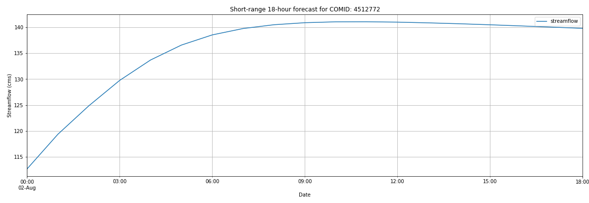

# Quickstart

Below is an example of a Short Range stream flow forecast for a stream segment on the Potomac River near DC. The `comid` representing this stream segment has been pulled from the NHDPlus V2.1 dataset.

```python
# Imports
import gcsfs
from fcast import Assim, ShortRange, plotShortRange
%matplotlib inline
```
```python
# Connect gcsfs to the National Water Model
fs = gcsfs.GCSFileSystem(project='national-water-model')
```
```python
# Parameters
date = '20190802' # a date
start_hr = '00' # start at 00:00
comid = 4512772 # stream segment on the Potomac near DC
```
```python
# Create a Short Range forecast and plot it
## Use the Assim class to get the Short Range forecast initial time/flow
sim = Assim(fs, comid, date, start_hr)
sr = ShortRange(fs, comid, date, start_hr)
sr_df = sr.get_streamflow(sim.assim_time, sim.assim_flow)
plotShortRange(sr_df, comid)
```
